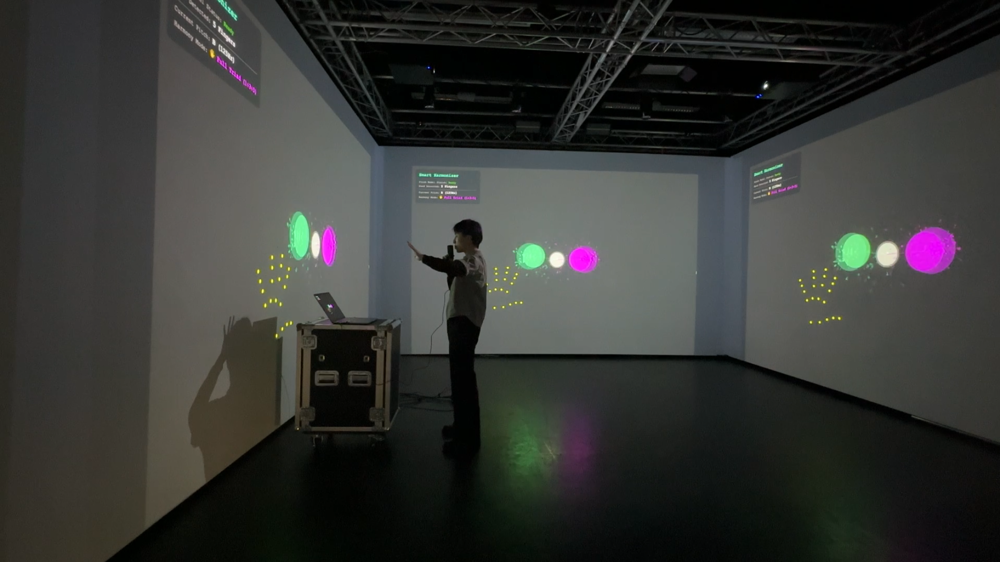
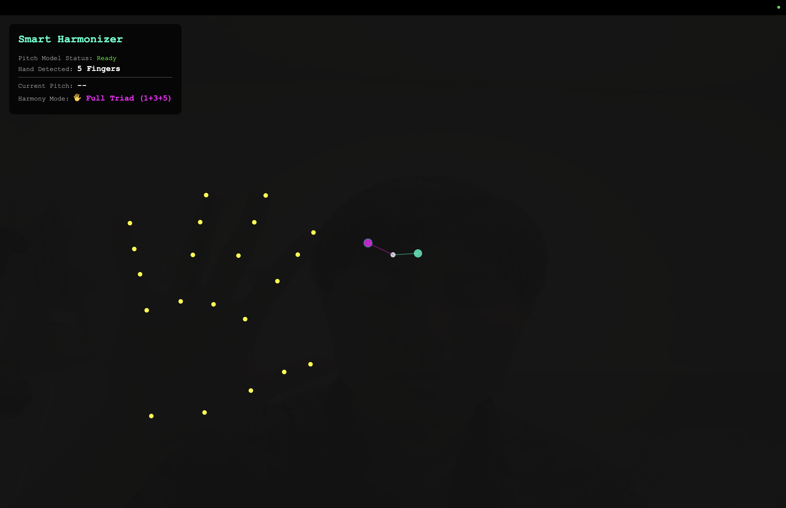

# **Smart Vocal Harmonizer**

**Date:** January 12, 2026

**Author:** Yu Ting Liao

**Project Type:** WCC1 Final Project (Pin-up) \- Technical Proof of Concept

## Short Description
Smart Vocal Harmonizer is a web-based interactive installation that transforms the human body into a musical instrument. By combining real-time audio analysis (Pitch Detection) with computer vision (Hand Pose), the system allows users to generate vocal harmonies simply by using hand gestures, creating an intuitive "body-instrument" experience.

## Concept / Intent
This project aims to bridge the gap between physical gesture and digital sound. While traditional harmonizers require keyboards or pedals, this project explores a more organic interface: the user's own hands. Using machine learning, the system tracks the user's fingers to trigger specific harmonic intervals (Major 3rd, Perfect 5th) on top of their singing voice. This creates a feedback loop where the user performs with both their voice and their body simultaneously.

## Technology Used
* **Language:** JavaScript (ES6)
* **Libraries:**
    * **p5.js (v1.9.0):** For canvas rendering and main logic.
    * **p5.sound.js:** For oscillators, audio input, and effects synthesis.
    * **ml5.js (v0.12.2):**
        * *PitchDetection (CREPE model):* For accurate vocal pitch tracking.
        * *Handpose:* For tracking finger positions to control harmony states.

## How to Run / Install
1.  **Clone or Download:**
    Download this repository to your local machine.
2.  **Start a Local Server (Crucial):**
    Due to browser security restrictions (CORS) on Camera and Microphone access, you **cannot** simply open `index.html`.
    * **VS Code (Recommended):** Install the "Live Server" extension, right-click `index.html`, and select "Open with Live Server".
    * **Terminal:** Run `python -m http.server` in the project directory.
3.  **Permissions:**
    Open the local URL (e.g., `127.0.0.1:5500`) and click **"Allow"** when prompted for **Camera** and **Microphone** access.
4.  **Wait for Models:**
    Wait until the button turns green and says "Start Experience", then click it.

### Interaction Guide (Gestures)
Sing or hum a steady note, then use your hand to control the harmony:
* **1 Finger (☝️):** Root note (Unison).
* **3 Fingers (✌️ + 1):** Adds a Major 3rd harmony.
* **5 Fingers (🖐️):** Adds a Perfect 5th (Completes the Major Triad).
* **Fist (✊):** Mutes the harmony.

## Requirements
**Software:**
* Modern Web Browser (Chrome recommended).
* Local Web Server environment.

**Hardware (Equipment List):**
* **Computer/Laptop:** Must have a webcam.
* **Webcam:** Required for Hand Pose detection.
* **Microphone:** Required for Pitch Detection (External mic recommended for accuracy).
* **Speakers/Headphones:** Headphones are strongly recommended to prevent feedback loops between the mic and speakers.

## Screenshots / Media
**Installation at The Church (Term 2 Pin-up)**

*Work installed at The Church, Goldsmiths. (Jan 2026)*

**Interface & Hand Tracking**

*Real-time hand tracking and harmony generation.*

Video: https://vimeo.com/1153548054?share=copy&fl=cl&fe=ci

## Credits / Acknowledgements
* **Student:** Yu Ting Liao
* **Course:** Workshops in Creative Coding 1
* **References:**
    * Dourish, P. (2001). Where the Action Is: The Foundations of Embodied Interaction. MIT Press.
    * Kandinsky, W. (1926). Point and Line to Plane. Bauhaus Books.
    * Krueger, M. W. (1991). Artificial Reality II. Addison-Wesley.
    * Heap, I. (2014). Mi.Mu Gloves. Available at: http://mimugloves.com [Accessed 8 Jan 2026].
    * McCarthy, L. et al. (2015). p5.js Reference. Available at: https://p5js.org/reference/
    * Shiffman, D. "ml5.js: Pitch Detection with CREPE". The Coding Train. Available at: https://thecodingtrain.com
    * Refsgaard, A. (2020). Pitch Painting [p5.js sketch]. Available at: https://editor.p5js.org/AndreasRef/sketches/XJKg1XLI

## License
This work is licensed under the Creative Commons Attribution-NonCommercial 4.0 International License (CC BY-NC 4.0).

## Contact / Links
* **GitHub Repo:** https://github.com/yvwHY/Smart-Vocal-Harmonizer.git
* **Email:** yvw.liao@gmail.com